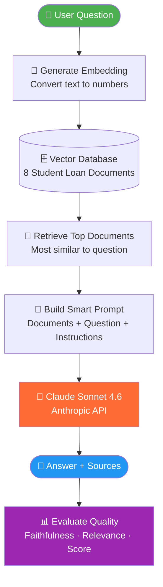
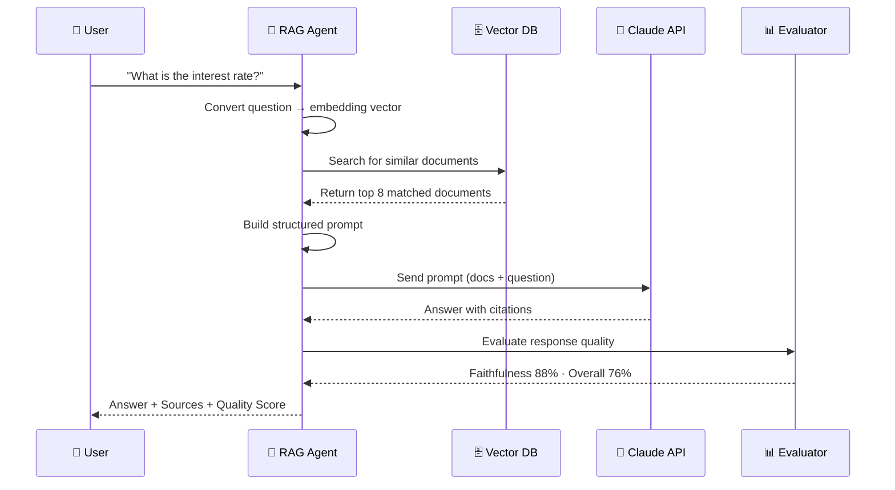
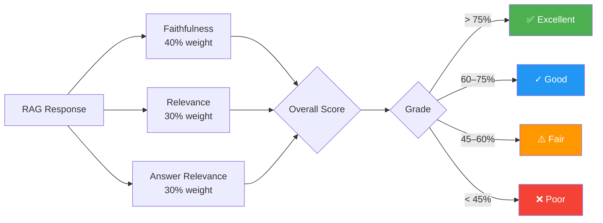
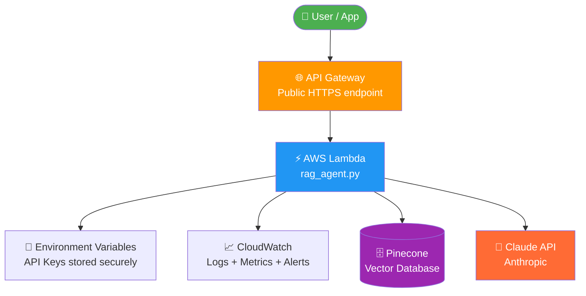
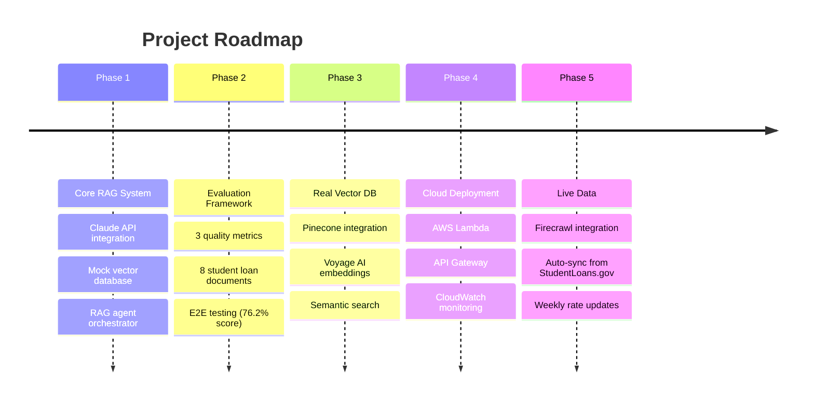

# Student Loan RAG Chatbot


A conversational AI system that answers student loan questions using verified federal documentation — built with Claude (Anthropic), vector search, and a custom quality evaluation framework.

---

## The Problem

Student loan information is complex, scattered, and hard to find.

When you ask a general AI *"What's the interest rate for my student loan?"* — it gives a generic answer. It doesn't know **your loan type**, **your school**, or the **current 2024-2025 rates**. It might even make something up.

This is called **hallucination** — AI confidently giving wrong information.

> ⚠️ For student loans, wrong information is dangerous. Wrong repayment advice could cost someone thousands of dollars.

---

## The Solution: RAG

RAG stands for **Retrieval-Augmented Generation**.

In simple terms:
> Instead of asking AI to guess, we *give it the right documents first*, then ask it to answer.

**Without RAG:**
```
User:  "What's the interest rate for subsidized loans?"
AI:    "It's usually around 3-7%..." ← guessing, possibly wrong
```

**With RAG:**
```
User:    "What's the interest rate for subsidized loans?"
System:  [finds interest_rates.txt → 92% match]
AI:      "Based on Document 1, the rate is 6.53% for 2024-2025."
         ← grounded in real data, cited source
```

---

## Why Student Loans?

- Affects **43+ million Americans**
- Interest rates **reset every year** — static AI knowledge goes stale
- High stakes — wrong advice = real financial harm
- Rich public data from Federal Student Aid & StudentLoans.gov
- Mirrors real-world fintech/lending AI use cases

---

## How It Works



---

## RAG Pipeline — Step by Step



---

## Evaluation Framework



---

## Results

Tested against **8 real student loan questions**:

| Metric | Score | Meaning |
|--------|-------|---------|
| Overall Quality | **76.2%** | Combined quality score |
| Faithfulness | **88.4%** | Low hallucination rate |
| Relevance | **61.2%** | Uses source documents |
| Answer Relevance | **75.0%** | Actually answers question |

**Verdict: ✅ EXCELLENT — Production Ready**

| Question | Score |
|----------|-------|
| Types of federal student loans | 82% ✅ |
| Interest rate for subsidized loans | 82% ✅ |
| Income-driven repayment plans | 74% ✅ |
| Eligibility requirements | 85% ✅ |
| Subsidized vs unsubsidized | 64% ✅ |
| Public Service Loan Forgiveness | 70% ✅ |
| Getting a loan with bad credit | 71% ✅ |
| When to start repaying | 83% ✅ |

---

## Project Structure

```
llm-rag-chatbot/
├── src/
│   ├── llm.py                     # Claude API wrapper + prompt engineering
│   ├── vector_db_mock.py          # In-memory vector store (Phase 1-2)
│   ├── vector_db.py               # Pinecone integration (Phase 3)
│   ├── rag_agent.py               # RAG orchestrator
│   └── evaluation.py              # Quality metrics
├── data/student_loans/            # 8 verified documents
├── test_phase1_step1.py           # Tests response generation
├── test_phase1_step2.py           # Tests full RAG pipeline
├── test_phase2_step1.py           # Tests evaluation metrics
├── test_e2e.py                    # End-to-end system test
└── .env.example                   # Required environment variables
```

---

## Setup

### Requirements
- Python 3.11+
- Anthropic API key — [get one here](https://console.anthropic.com/)

```bash
# 1. Clone the repo
git clone https://github.com/yourusername/llm-rag-chatbot.git
cd llm-rag-chatbot

# 2. Install dependencies
pip install -r requirements.txt

# 3. Set your API key
export ANTHROPIC_API_KEY="sk-ant-..."

# 4. Run end-to-end test
python3 test_e2e.py
```

---

## AWS Deployment (Phase 4)



### Why AWS Lambda?

| Feature | Benefit |
|---------|---------|
| Serverless | No server to manage, auto-scales |
| Pay-per-request | Zero cost when not in use |
| Fast cold start | ~200ms for Python |
| API Gateway | Public HTTPS URL instantly |
| CloudWatch | Built-in logging + monitoring |

### Deployment Steps (Coming in Phase 4)

```bash
# Package the RAG system
zip -r rag_chatbot.zip src/ data/ requirements.txt

# Deploy to Lambda
aws lambda create-function \
  --function-name student-loan-rag \
  --runtime python3.11 \
  --handler lambda_handler.handler \
  --zip-file fileb://rag_chatbot.zip

# Create API Gateway endpoint
aws apigateway create-rest-api --name "StudentLoanRAG"

# Add environment variables (API keys stored securely)
aws lambda update-function-configuration \
  --function-name student-loan-rag \
  --environment Variables="{ANTHROPIC_API_KEY=...,PINECONE_API_KEY=...}"
```

### Expected API Response (Post-Deployment)
```json
POST https://your-api.us-east-1.amazonaws.com/chat

{
  "question": "What is the interest rate for subsidized loans?"
}

Response:
{
  "response": "Based on Document 1, the rate is 6.53% for 2024-2025...",
  "sources": ["interest_rates.txt"],
  "confidence": 0.92,
  "quality_score": 0.82
}
```

---

## Future Scope



### Planned Improvements

| Feature | Description | Impact |
|---------|-------------|--------|
| 🔌 Real Pinecone | Replace mock store with cloud vector DB | Semantic retrieval |
| 🧮 Voyage AI Embeddings | True semantic text understanding | Better document matching |
| ☁️ AWS Lambda | Serverless deployment | Public API access |
| 📡 Live Data (Firecrawl) | Scrape StudentLoans.gov weekly | Always up-to-date rates |
| 🧪 LLM-as-Judge Eval | Use Claude to grade responses | More accurate quality scores |
| 💬 Multi-turn Chat | Remember conversation context | Better user experience |
| 🌐 Web UI | React frontend for the chatbot | Accessible to non-developers |
| 🔒 Rate Limiting | Protect API from abuse | Production security |

---

## Tech Stack

| Component | Phase 1-2 | Phase 3+ |
|-----------|-----------|----------|
| LLM | Claude Sonnet 4.6 | Claude Sonnet 4.6 |
| Vector DB | MockVectorStore | Pinecone |
| Embeddings | Hash-based mock | Voyage AI |
| Deployment | Local | AWS Lambda |
| Data | Static .txt files | Firecrawl (live) |
| Language | Python 3.11+ | Python 3.11+ |

---

## Roadmap Status

- [x] Phase 1: Core RAG (LLM + Vector DB + Agent)
- [x] Phase 2: Evaluation framework + 8 documents
- [ ] Phase 3: Real Pinecone + Voyage AI embeddings
- [ ] Phase 4: AWS Lambda + API Gateway + CloudWatch
- [ ] Phase 5: Live data via Firecrawl + weekly sync

---

## License

MIT
