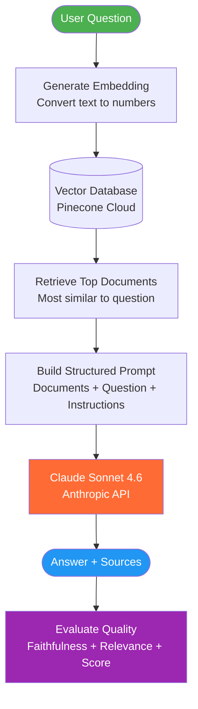
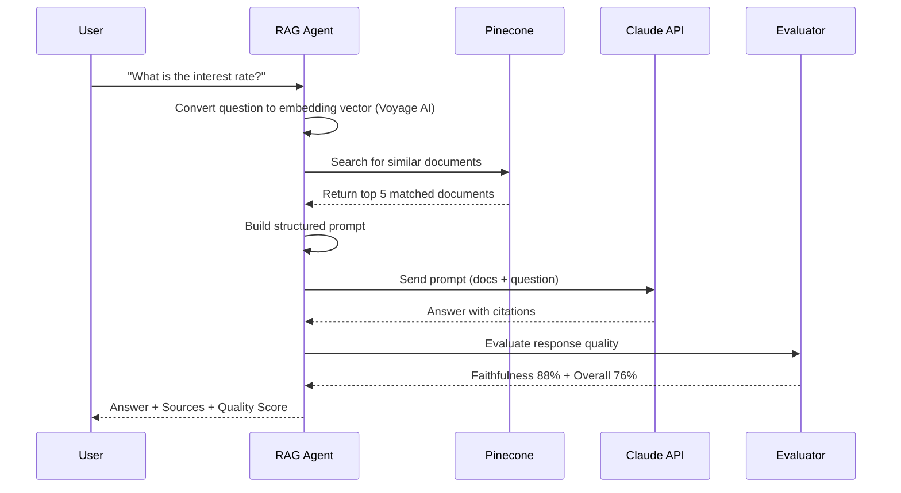
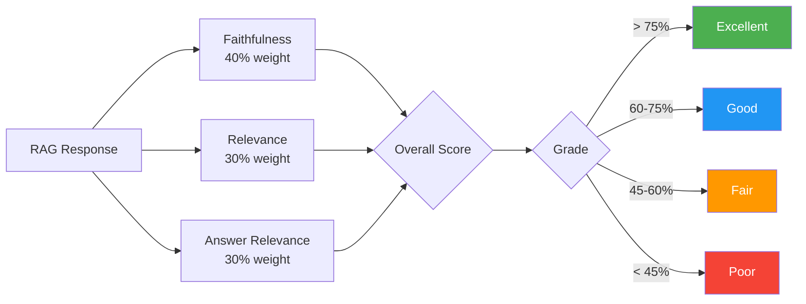
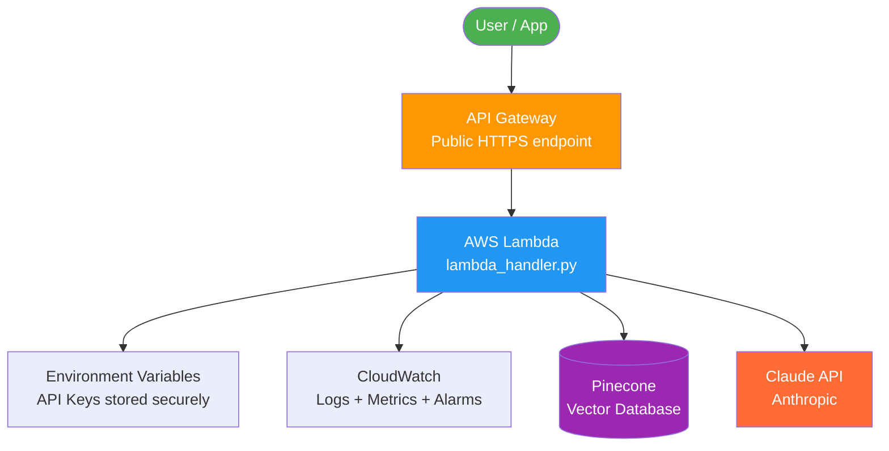
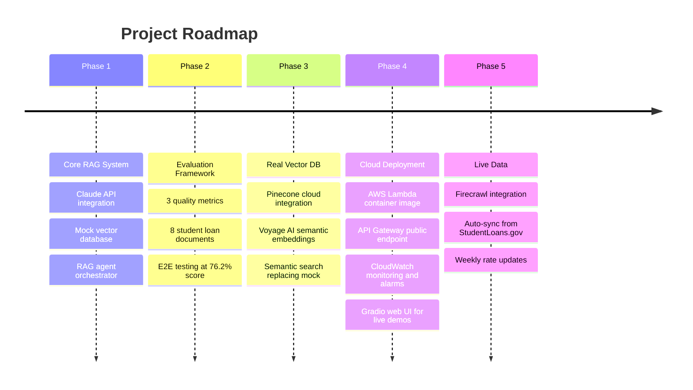

# Student Loan RAG Chatbot


A conversational AI system that answers student loan questions using verified federal documentation. Built with Claude (Anthropic), Pinecone vector search, Voyage AI embeddings, and a custom quality evaluation framework.

---

## The Problem

Student loan information is complex, scattered, and hard to find.

When you ask a general AI "What's the interest rate for my student loan?", it gives a generic answer. It does not know your loan type, your school, or the current 2024-2025 rates. It might even make something up.

This is called **hallucination**: AI confidently giving wrong information.

> For student loans, wrong information is dangerous. Wrong repayment advice could cost someone thousands of dollars.

---

## The Solution: RAG

RAG stands for **Retrieval-Augmented Generation**.

> Instead of asking AI to guess, we give it the right documents first, then ask it to answer.

**Without RAG:**
```
User:  "What's the interest rate for subsidized loans?"
AI:    "It's usually around 3-7%..." (guessing, possibly wrong)
```

**With RAG:**
```
User:    "What's the interest rate for subsidized loans?"
System:  [finds interest_rates.txt, 92% match]
AI:      "Based on Document 1, the rate is 6.53% for 2024-2025."
         (grounded in real data, cited source)
```

---

## Why Student Loans?

- Affects **43+ million students in America**
- Interest rates **reset every year**, so static AI knowledge goes stale
- High stakes: wrong advice means real financial harm
- Rich public data from Federal Student Aid and StudentLoans.gov
- Mirrors real-world fintech and lending AI use cases

---

## How It Works



---

## RAG Pipeline: Step by Step



---

## Evaluation Framework



---

## Results

Tested against **8 real student loan questions**:

| Metric | Score | Meaning |
|--------|-------|---------|
| Overall Quality | **76.2%** | Combined quality score |
| Faithfulness | **88.4%** | Low hallucination rate |
| Relevance | **61.2%** | Uses source documents |
| Answer Relevance | **75.0%** | Actually answers the question |

**Verdict: EXCELLENT, Production Ready**

| Question | Score |
|----------|-------|
| Types of federal student loans | 82% |
| Interest rate for subsidized loans | 82% |
| Income-driven repayment plans | 74% |
| Eligibility requirements | 85% |
| Subsidized vs unsubsidized | 64% |
| Public Service Loan Forgiveness | 70% |
| Getting a loan with bad credit | 71% |
| When to start repaying | 83% |

---

## Project Structure

```
llm-rag-chatbot/
├── src/
│   ├── llm.py                     # Claude API wrapper + Voyage AI embeddings
│   ├── vector_db.py               # Pinecone cloud integration (Phase 3)
│   ├── vector_db_mock.py          # In-memory vector store (Phase 1-2 baseline)
│   ├── rag_agent.py               # RAG orchestrator
│   └── evaluation.py              # Quality metrics (faithfulness, relevance)
├── data/student_loans/            # 8 verified federal documents
├── app.py                         # Gradio web UI (live demo)
├── lambda_handler.py              # AWS Lambda entry point
├── Dockerfile                     # Lambda container image
├── cloudwatch_config.json         # CloudWatch alarms and dashboard config
├── setup_pinecone.py              # One-time document ingestion script
├── test_phase1_step1.py           # Tests response generation
├── test_phase1_step2.py           # Tests full RAG pipeline
├── test_phase2_step1.py           # Tests evaluation metrics
├── test_e2e.py                    # End-to-end system test (8 questions)
└── .env.example                   # Required environment variables
```

---

## Setup

### Requirements

- Python 3.11+
- Anthropic API key
- Pinecone API key
- Voyage AI API key

```bash
# 1. Clone the repo
git clone https://github.com/drona23/llm-rag-chatbot.git
cd llm-rag-chatbot

# 2. Create virtual environment
python3.11 -m venv venv
source venv/bin/activate

# 3. Install dependencies
pip install -r requirements.txt

# 4. Configure environment variables
cp .env.example .env
# Edit .env with your API keys

# 5. Upload documents to Pinecone (one time)
python setup_pinecone.py

# 6. Run end-to-end test
python test_e2e.py

# 7. Launch the web UI
python app.py
```

---

## Web UI (Gradio)

The Gradio interface runs locally at `http://localhost:7860`.

Layout:
- **Left panel**: Chat interface with example questions
- **Right panel**: Live source documents with cosine similarity scores and confidence level per response

```bash
source venv/bin/activate
python app.py
```

To get a shareable public link for demos:
```python
# In app.py, change the last line to:
demo.launch(share=True)
```

---

## AWS Deployment (Phase 4)



### Why AWS Lambda?

| Feature | Benefit |
|---------|---------|
| Serverless | No server to manage, auto-scales |
| Pay per request | Zero cost when idle |
| Container image | Supports large dependencies (10GB limit) |
| API Gateway | Public HTTPS URL instantly |
| CloudWatch | Built-in logging, alarms, and dashboards |

### Deployment Steps

```bash
# 1. Build container image
docker build -t rag-chatbot .

# 2. Tag and push to Amazon ECR
aws ecr create-repository --repository-name rag-chatbot
docker tag rag-chatbot:latest <account>.dkr.ecr.us-east-1.amazonaws.com/rag-chatbot:latest
docker push <account>.dkr.ecr.us-east-1.amazonaws.com/rag-chatbot:latest

# 3. Create Lambda function from container
aws lambda create-function \
  --function-name rag-chatbot \
  --package-type Image \
  --code ImageUri=<account>.dkr.ecr.us-east-1.amazonaws.com/rag-chatbot:latest \
  --role arn:aws:iam::<account>:role/lambda-execution-role

# 4. Set environment variables (API keys stored securely)
aws lambda update-function-configuration \
  --function-name rag-chatbot \
  --environment Variables="{ANTHROPIC_API_KEY=...,PINECONE_API_KEY=...,VOYAGE_API_KEY=...}"

# 5. Create API Gateway endpoint
aws apigateway create-rest-api --name "StudentLoanRAG"
```

### API Request and Response

```json
POST https://your-api.execute-api.us-east-1.amazonaws.com/chat
Content-Type: application/json

{
  "message": "What is the interest rate for subsidized loans?"
}

Response:
{
  "response": "Based on Document 1, the rate is 6.53% for 2024-2025...",
  "sources": ["Based on the 2024-2025 academic year..."],
  "confidence": 0.92,
  "retrieval_scores": [0.94, 0.91, 0.88, 0.85, 0.82]
}
```

---

## Project Roadmap



---

## Roadmap Status

- [x] Phase 1: Core RAG (LLM + Vector DB + Agent)
- [x] Phase 2: Evaluation framework + 8 documents
- [x] Phase 3: Real Pinecone + Voyage AI embeddings
- [x] Phase 4: AWS Lambda + API Gateway + CloudWatch + Gradio UI
- [ ] Phase 5: Live data via Firecrawl + weekly sync

---

## Tech Stack

| Component | Phase 1-2 | Phase 3+ |
|-----------|-----------|----------|
| LLM | Claude Sonnet 4.6 | Claude Sonnet 4.6 |
| Vector DB | MockVectorStore | Pinecone (cloud) |
| Embeddings | Hash-based mock | Voyage AI (semantic) |
| Deployment | Local | AWS Lambda + Docker |
| UI | None | Gradio web interface |
| Data | Static .txt files | Static .txt (Firecrawl planned) |
| Language | Python 3.11+ | Python 3.11+ |

---

## License

MIT
